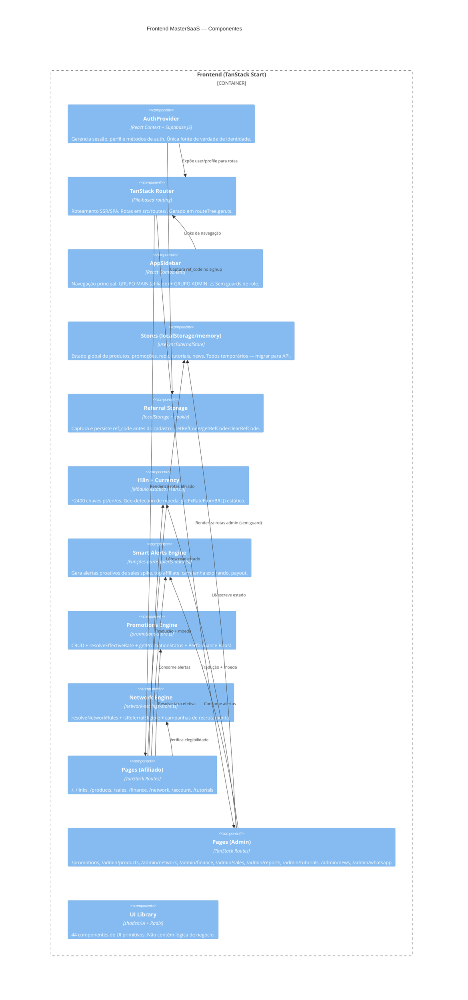
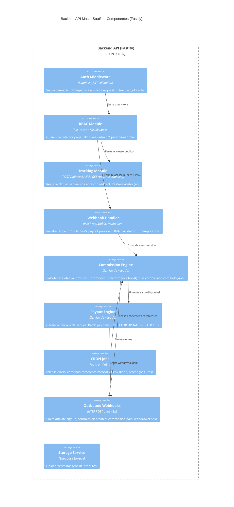

# C4 — Componentes (Nível 3) — MasterSaaS
> Arquiteto (Reversa v1.2.14) — 2026-06-08

---

## Frontend — Componentes Internos

```mermaid
C4Component
    title Frontend MasterSaaS — Componentes

    Container_Boundary(frontend, "Frontend (TanStack Start)") {

        Component(auth_provider, "AuthProvider", "React Context + Supabase JS", "Gerencia sessão, perfil e métodos de auth. Única fonte de verdade de identidade.")

        Component(router, "TanStack Router", "File-based routing", "Roteamento SSR/SPA. Rotas em src/routes/. Gerado em routeTree.gen.ts.")

        Component(sidebar, "AppSidebar", "React Component", "Navegação principal. GRUPO MAIN (afiliado) + GRUPO ADMIN. ⚠️ Sem guards de role.")

        Component(stores, "Stores (localStorage/memory)", "useSyncExternalStore", "Estado global de produtos, promoções, rede, tutoriais, news. Todos temporários — migrar para API.")

        Component(referral_storage, "Referral Storage", "localStorage + cookie", "Captura e persiste ref_code antes do cadastro. setRefCode/getRefCode/clearRefCode.")

        Component(i18n, "i18n + Currency", "Módulo estático (i18n.ts)", "~2400 chaves pt/en/es. Geo-detection de moeda. getFxRateFromBRL() estático.")

        Component(alerts_engine, "Smart Alerts Engine", "Funções puras (alerts-data.ts)", "Gera alertas proativos de sales spike, top affiliate, campanha expirando, payout.")

        Component(promo_engine, "Promotions Engine", "promotions-store.ts", "CRUD + resolveEffectiveRate + getPromotionStatus + Performance Boost.")

        Component(network_engine, "Network Engine", "network-settings-store.ts", "resolveNetworkRules + isReferralEligible + campanhas de recrutamento.")

        Component(pages_affiliate, "Pages (Afiliado)", "TanStack Routes", "/, /links, /products, /sales, /finance, /network, /account, /tutorials")

        Component(pages_admin, "Pages (Admin)", "TanStack Routes", "/promotions, /admin/products, /admin/network, /admin/finance, /admin/sales, /admin/reports, /admin/tutorials, /admin/news, /admin/whatsapp")

        Component(ui_lib, "UI Library", "shadcn/ui + Radix", "44 componentes de UI primitivos. Não contém lógica de negócio.")
    }

    Rel(auth_provider, router, "Expõe user/profile para rotas")
    Rel(router, pages_affiliate, "Renderiza rotas afiliado")
    Rel(router, pages_admin, "Renderiza rotas admin (sem guard)")
    Rel(pages_affiliate, stores, "Lê/escreve estado")
    Rel(pages_admin, stores, "Lê/escreve estado")
    Rel(pages_affiliate, alerts_engine, "Consome alertas")
    Rel(pages_admin, alerts_engine, "Consome alertas")
    Rel(pages_affiliate, promo_engine, "Resolve taxa efetiva")
    Rel(pages_affiliate, network_engine, "Verifica elegibilidade")
    Rel(auth_provider, referral_storage, "Captura ref_code no signup")
    Rel(pages_affiliate, i18n, "Tradução + moeda")
    Rel(pages_admin, i18n, "Tradução + moeda")
    Rel(sidebar, router, "Links de navegação")
```

---

## Backend API — Componentes (A construir)

```mermaid
C4Component
    title Backend API MasterSaaS — Componentes (Fastify)

    Container_Boundary(api, "Backend API (Fastify)") {

        Component(auth_middleware, "Auth Middleware", "Supabase JWT validation", "Valida token JWT do Supabase em cada request. Extrai user_id e role.")

        Component(rbac, "RBAC Module", "has_role() + Fastify hooks", "Guards de rota por papel. Bloqueia /admin/* para não-admin.")

        Component(tracking, "Tracking Module", "POST /api/track/click, GET /api/r/:userId/:slug", "Registra cliques server-side antes do redirect. Rastreia atribuição.")

        Component(webhook_handler, "Webhook Handler", "POST /api/public/webhook/*", "Recebe Stripe, produto SaaS, payout provider. HMAC validation + idempotência.")

        Component(commission_engine, "Commission Engine", "Serviço de negócio", "Calcula taxa efetiva (produto + promoção + performance boost). Cria commission com hold_until.")

        Component(payout_engine, "Payout Engine", "Serviço de negócio", "Gerencia lifecycle de saques. Batch pay com SELECT FOR UPDATE SKIP LOCKED.")

        Component(cron_jobs, "CRON Jobs", "pg_cron / n8n", "release diário, comissão recorrente mensal, at-risk diário, promoções 5min.")

        Component(outbound_webhooks, "Outbound Webhooks", "HTTP POST para n8n", "Emite affiliate.signup, commission.created, commission.paid, withdrawal.paid.")

        Component(storage_service, "Storage Service", "Supabase Storage", "Upload/serve imagens de produtos.")
    }

    Rel(auth_middleware, rbac, "Passa user + role")
    Rel(rbac, tracking, "Permite acesso público")
    Rel(rbac, webhook_handler, "Permite acesso público (HMAC)")
    Rel(webhook_handler, commission_engine, "Cria sale + commission")
    Rel(commission_engine, payout_engine, "Alimenta saldo disponível")
    Rel(cron_jobs, commission_engine, "Release pendentes + recorrentes")
    Rel(commission_engine, outbound_webhooks, "Emite eventos")
    Rel(payout_engine, outbound_webhooks, "Emite withdrawal.paid")
```
