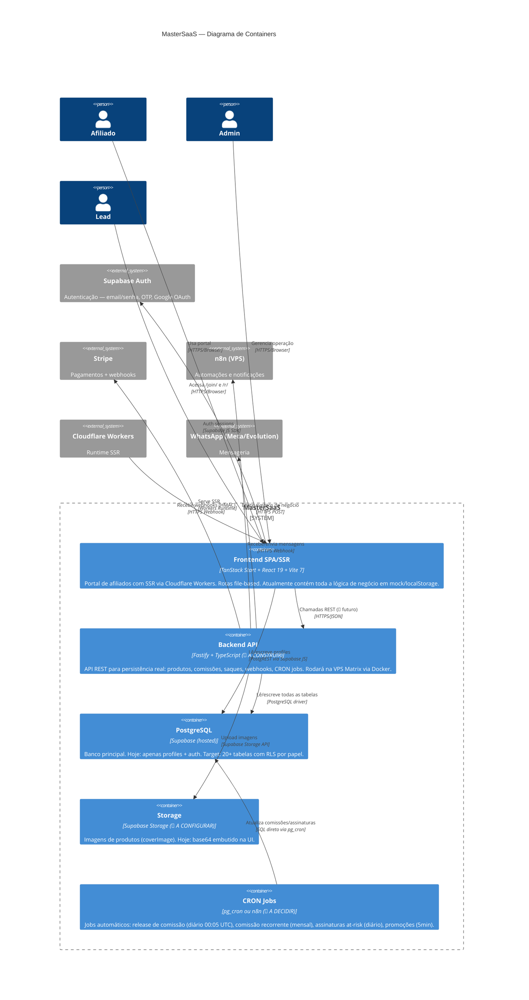

# C4 — Containers (Nível 2) — MasterSaaS
> Arquiteto (Reversa v1.2.14) — 2026-06-08

```mermaid
C4Container
    title MasterSaaS — Diagrama de Containers

    Person(affiliate, "Afiliado")
    Person(admin, "Admin")
    Person(lead, "Lead")

    System_Boundary(mastersaas_sys, "MasterSaaS") {

        Container(frontend, "Frontend SPA/SSR", "TanStack Start + React 19 + Vite 7", "Portal de afiliados com SSR via Cloudflare Workers. Rotas file-based. Atualmente contém toda a lógica de negócio em mock/localStorage.")

        Container(api, "Backend API", "Fastify + TypeScript (🔴 A CONSTRUIR)", "API REST para persistência real: produtos, comissões, saques, webhooks, CRON jobs. Rodará na VPS Matrix via Docker.")

        Container(db, "PostgreSQL", "Supabase (hosted)", "Banco principal. Hoje: apenas profiles + auth. Target: 20+ tabelas com RLS por papel.")

        Container(storage, "Storage", "Supabase Storage (🔴 A CONFIGURAR)", "Imagens de produtos (coverImage). Hoje: base64 embutido na UI.")

        Container(cron, "CRON Jobs", "pg_cron ou n8n (🔴 A DECIDIR)", "Jobs automáticos: release de comissão (diário 00:05 UTC), comissão recorrente (mensal), assinaturas at-risk (diário), promoções (5min).")
    }

    System_Ext(supabase_auth, "Supabase Auth", "Autenticação — email/senha, OTP, Google OAuth")
    System_Ext(stripe, "Stripe", "Pagamentos + webhooks")
    System_Ext(n8n, "n8n (VPS)", "Automações e notificações")
    System_Ext(cloudflare, "Cloudflare Workers", "Runtime SSR")
    System_Ext(whatsapp, "WhatsApp (Meta/Evolution)", "Mensageria")

    Rel(affiliate, frontend, "Usa portal", "HTTPS/Browser")
    Rel(admin, frontend, "Gerencia operação", "HTTPS/Browser")
    Rel(lead, frontend, "Acessa /join/ e /r/", "HTTPS/Browser")

    Rel(frontend, supabase_auth, "Auth sessions", "Supabase JS SDK")
    Rel(frontend, db, "Lê/escreve profiles", "PostgREST via Supabase JS")
    Rel(frontend, api, "Chamadas REST (🔴 futuro)", "HTTPS/JSON")

    Rel(api, db, "Lê/escreve todas as tabelas", "PostgreSQL driver")
    Rel(api, storage, "Upload imagens", "Supabase Storage API")
    Rel(api, stripe, "Recebe webhooks (HMAC)", "HTTPS Webhook")
    Rel(api, n8n, "Emite eventos de negócio", "HTTPS POST")
    Rel(api, whatsapp, "Recebe/envia mensagens", "HTTPS Webhook")

    Rel(cron, db, "Atualiza comissões/assinaturas", "SQL direto via pg_cron")
    Rel(cloudflare, frontend, "Serve SSR", "Workers Runtime")
```
