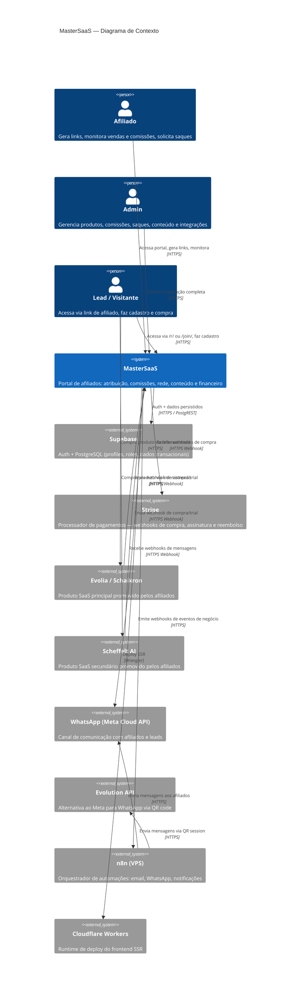

# C4 — Contexto (Nível 1) — MasterSaaS
> Arquiteto (Reversa v1.2.14) — 2026-06-08

```mermaid
C4Context
    title MasterSaaS — Diagrama de Contexto

    Person(affiliate, "Afiliado", "Gera links, monitora vendas e comissões, solicita saques")
    Person(admin, "Admin", "Gerencia produtos, comissões, saques, conteúdo e integrações")
    Person(lead, "Lead / Visitante", "Acessa via link de afiliado, faz cadastro e compra")

    System(mastersaas, "MasterSaaS", "Portal de afiliados: atribuição, comissões, rede, conteúdo e financeiro")

    System_Ext(supabase, "Supabase", "Auth + PostgreSQL (profiles, roles, dados transacionais)")
    System_Ext(stripe, "Stripe", "Processador de pagamentos — webhooks de compra, assinatura e reembolso")
    System_Ext(schaikron, "Evolia / Schaikron", "Produto SaaS principal promovido pelos afiliados")
    System_Ext(scheffelt_ai, "Scheffelt AI", "Produto SaaS secundário promovido pelos afiliados")
    System_Ext(whatsapp_meta, "WhatsApp (Meta Cloud API)", "Canal de comunicação com afiliados e leads")
    System_Ext(whatsapp_evo, "Evolution API", "Alternativa ao Meta para WhatsApp via QR code")
    System_Ext(n8n, "n8n (VPS)", "Orquestrador de automações: email, WhatsApp, notificações")
    System_Ext(cloudflare, "Cloudflare Workers", "Runtime de deploy do frontend SSR")

    Rel(affiliate, mastersaas, "Acessa portal, gera links, monitora", "HTTPS")
    Rel(admin, mastersaas, "Gerencia operação completa", "HTTPS")
    Rel(lead, mastersaas, "Acessa via /r/ ou /join/, faz cadastro", "HTTPS")

    Rel(mastersaas, supabase, "Auth + dados persistidos", "HTTPS / PostgREST")
    Rel(mastersaas, stripe, "Recebe webhooks de compra", "HTTPS Webhook")
    Rel(mastersaas, n8n, "Emite webhooks de eventos de negócio", "HTTPS")
    Rel(mastersaas, cloudflare, "Deploy SSR", "Wrangler")

    Rel(lead, schaikron, "Compra produto via link rastreado", "HTTPS")
    Rel(lead, scheffelt_ai, "Compra produto via link rastreado", "HTTPS")
    Rel(schaikron, mastersaas, "Envia webhook de compra/trial", "HTTPS Webhook")
    Rel(scheffelt_ai, mastersaas, "Envia webhook de compra/trial", "HTTPS Webhook")

    Rel(n8n, whatsapp_meta, "Envia mensagens aos afiliados", "HTTPS")
    Rel(n8n, whatsapp_evo, "Envia mensagens via QR session", "HTTPS")
    Rel(mastersaas, whatsapp_meta, "Recebe webhooks de mensagens", "HTTPS Webhook")
```
