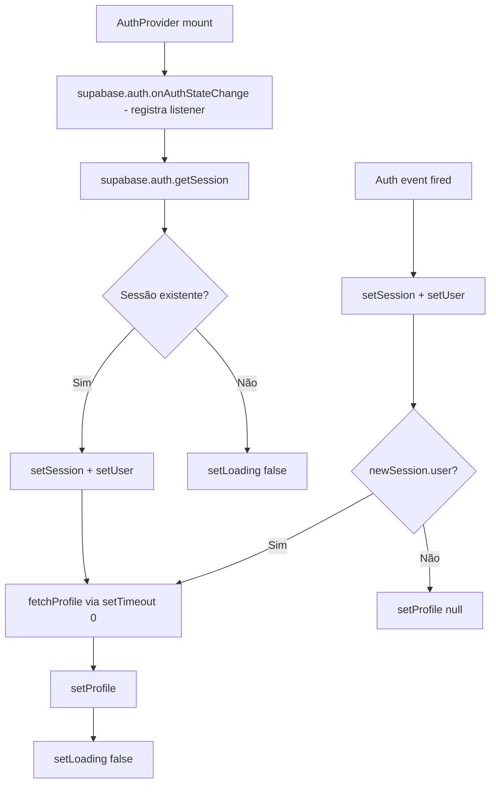

# Flowchart — Módulo Auth
> Arqueólogo (Reversa v1.2.14) — 2026-06-08

---

## Fluxo: Signup com Referral

```mermaid
flowchart TD
    A[Usuário acessa /join/:code] --> B[setRefCode(code)]
    B --> C{Usuário autenticado?}
    C -->|Sim| D[Redireciona /]
    C -->|Não| E[Redireciona /signup]
    E --> F[SignupPage carrega]
    F --> G[getRefCode() → exibe banner de convite]
    G --> H[Usuário preenche email + senha + nome]
    H --> I[handleSubmit: signUp(email, password, name)]
    I --> J[getRefCode() → captura ref_code]
    J --> K[supabase.auth.signUp com raw_user_meta_data]
    K --> L{Erro?}
    L -->|Sim| M[toast.error + fim]
    L -->|Não| N{ref_code presente?}
    N -->|Sim| O[markWelcomePending(refCode)]
    O --> P[clearRefCode()]
    P --> Q[fetchProfile(user.id)]
    N -->|Não| Q
    Q --> R[navigate /]
```

---

## Fluxo: Login por OTP (método principal)

```mermaid
flowchart TD
    A[LoginPage - modo main] --> B[Usuário digita email]
    B --> C[handleSendOtp]
    C --> D[sendEmailOtp(email)]
    D --> E[supabase.auth.signInWithOtp com referred_by_code]
    E --> F{Erro?}
    F -->|Sim| G[toast.error]
    F -->|Não| H[setMode otp-sent]
    H --> I[Usuário digita 6 dígitos]
    I --> J[handleVerifyOtp]
    J --> K{otp.length === 6?}
    K -->|Não| L[toast.error]
    K -->|Sim| M[verifyEmailOtp(email, otp)]
    M --> N[supabase.auth.verifyOtp type=email]
    N --> O{Erro?}
    O -->|Sim| P[toast.error]
    O -->|Não| Q{ref_code presente?}
    Q -->|Sim| R[markWelcomePending + clearRefCode]
    Q -->|Não| S[navigate /]
    R --> S
```

---

## Fluxo: Inicialização do AuthProvider



---

## Fluxo: fetchProfile

```mermaid
flowchart TD
    A[fetchProfile(userId)] --> B[supabase.from('profiles').select(...).eq('id', userId).maybeSingle()]
    B --> C{Erro?}
    C -->|Sim| D[console.error → retorna null]
    C -->|Não| E[Retorna Profile ou null]
```

---

## Fluxo: setRefCode (normalização)

```mermaid
flowchart TD
    A[setRefCode(raw)] --> B{window definido?}
    B -->|Não| C[return - SSR skip]
    B -->|Sim| D[UPPERCASE + remove não-A-Z0-9 + slice 16]
    D --> E{code vazio?}
    E -->|Sim| C
    E -->|Não| F[localStorage.setItem('ref_code', code)]
```
