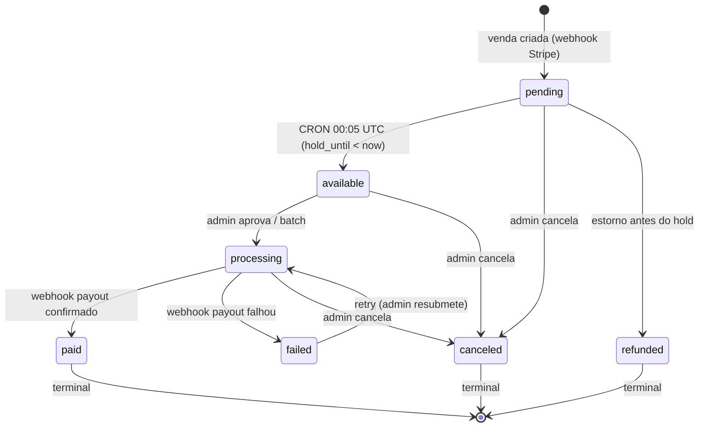
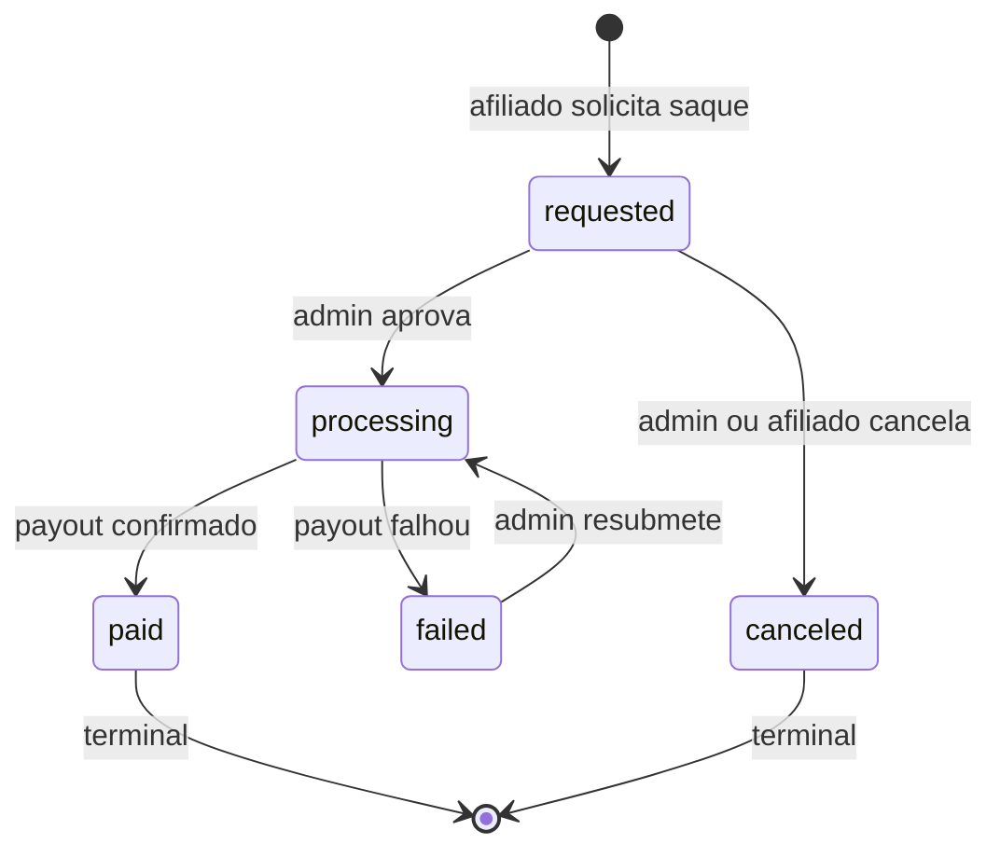
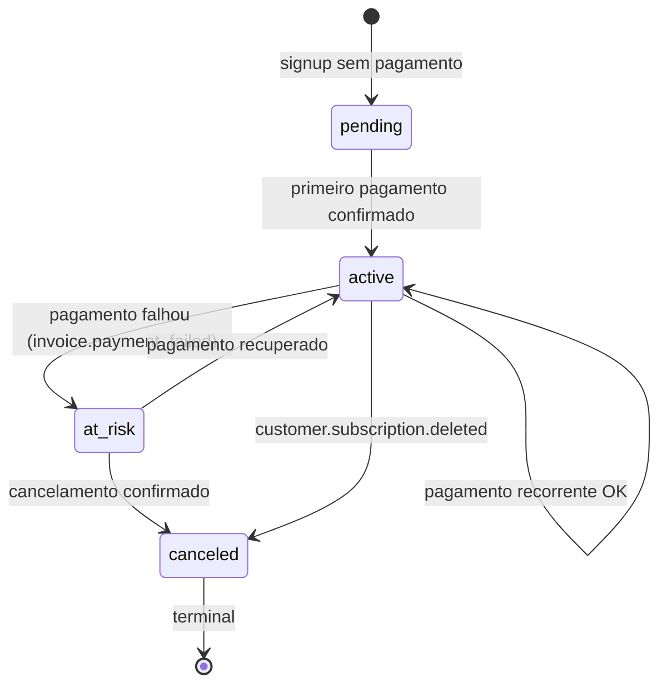
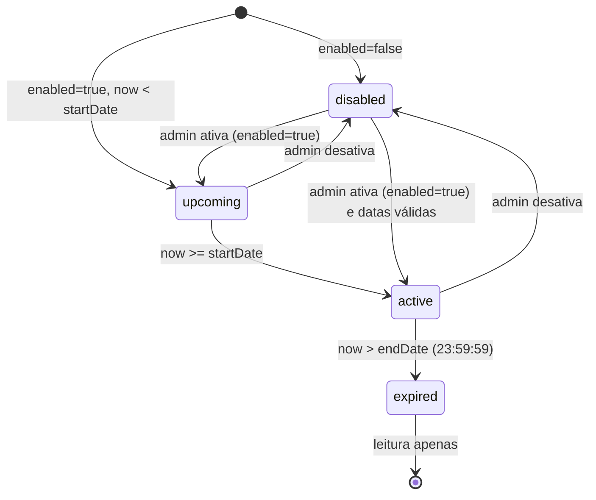
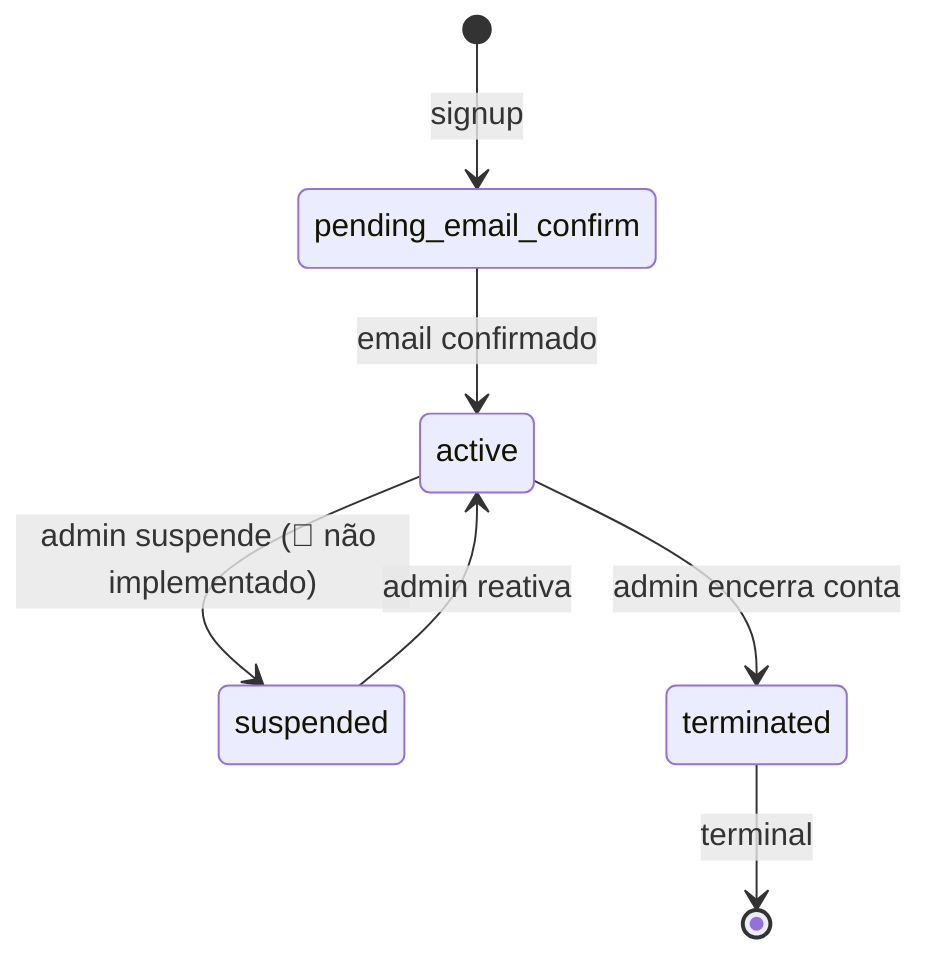
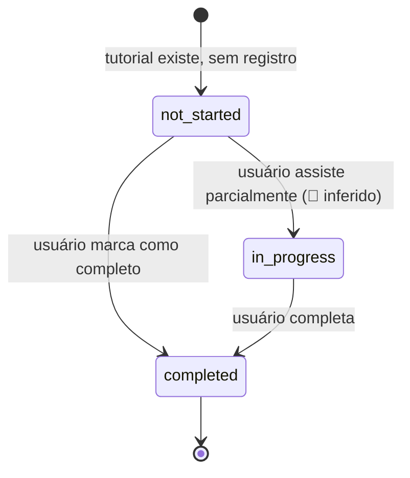
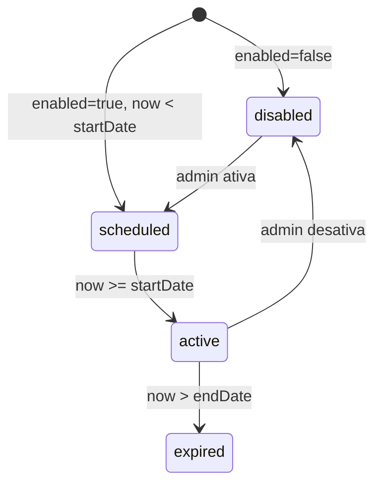

# Máquinas de Estado — MasterSaaS
> Gerado pelo Detetive (Reversa v1.2.14) — 2026-06-08
> 🟢 CONFIRMADO | 🟡 INFERIDO | 🔴 LACUNA

---

## 1. Comissão (Commission)

> ⚠️ Divergência: frontend usa `pending | processing | paid | partially_paid | reversed`. Backend deve adotar schema do blueprint que é mais completo.

### Schema recomendado para o backend

### Transições inválidas (bloquear no backend)
- `paid → qualquer` — comissão paga é imutável
- `refunded → qualquer` — estorno é terminal
- `canceled → paid` — cancelado não pode ser pago diretamente

### Gatilhos por transição

| Transição | Gatilho | Responsável |
|-----------|---------|-------------|
| `→ pending` | Webhook `checkout.session.completed` | Stripe / Produto SaaS |
| `pending → available` | CRON diário 00:05 UTC | pg_cron ou n8n |
| `→ canceled` | Admin action | Admin via UI |
| `→ refunded` | Webhook `charge.refunded` | Stripe |
| `available → processing` | Admin batch pay | Admin via UI |
| `processing → paid` | Webhook payout provider | PIX / Stripe Connect |
| `processing → failed` | Webhook payout failed | PIX / Stripe Connect |

---

## 2. Saque (Withdrawal)

### Regras de validação no `requested`
- `amount >= minWithdrawal` (🔴 valor não definido)
- `amount <= availableBalance`
- `payment_method` cadastrado e válido
- `idempotency_key` único por (affiliate_id, key)

---

## 3. Assinatura (Subscription)

### Regra de comissão recorrente
- Enquanto `active` E `payments_made < commissionDurationMonths` (ou Lifetime): gera nova commission mensal
- Ao `canceled`: interrompe geração futura, preserva históricas

---

## 4. Promoção (Promotion) — estado calculado, não armazenado

---

## 5. Afiliado / Profile (proposto para backend)

---

## 6. Tutorial Progress (por usuário × tutorial)

> 🟡 Estado `in_progress` inferido — o código atual rastreia `watched` (boolean) por vídeo, sem duração intermediária.

---

## 7. Campanha de Rede (NetworkCampaign) — calculado

